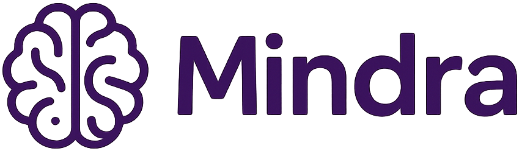
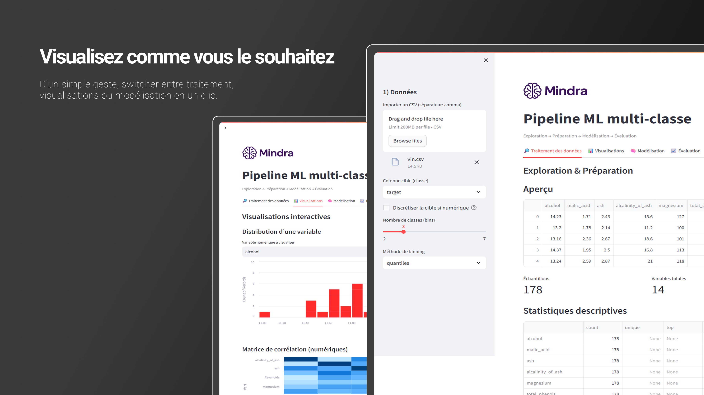
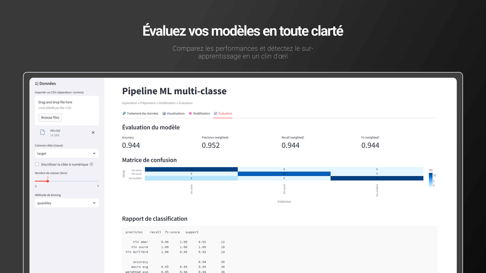

<p align="center">
  
</p>

<p align="center">
  <b>L'atelier visuel du Machine Learning</b><br>
  Explorez, préparez, entraînez et évaluez vos modèles en quelques clics.
</p>

<p align="center">
  
  
  
</p>

---

## Présentation

**Mindra** est une application interactive développée avec **Streamlit** qui permet de construire un **pipeline complet de Machine Learning** — sans écrire une ligne de code.  

Elle regroupe en une interface fluide tout le processus de modélisation :
- **Exploration des données**
- **Préparation / nettoyage**
- **Sélection des variables**
- **Entraînement et évaluation de modèles**

> De la donnée brute au modèle prêt à être déployé : tout se fait en quelques clics.

---

## Fonctionnalités principales

### 1. Exploration des données
- Chargement de CSV (ex : `vin.csv`)
- Statistiques descriptives automatiques
- Détection des valeurs manquantes
- Analyse des corrélations
- Visualisations interactives (Altair)

### 2. Préparation
- Imputation (moyenne, médiane, mode)
- Normalisation (Standard, MinMax, Robust)
- Gestion des outliers (Winsorisation IQR)
- Sélection de variables (VarianceThreshold / ANOVA)
- Détection automatique de classes rares

### 3. Modélisation
- Division train/test avec stratification automatique
- Modèles disponibles :
  - Régression logistique
  - Random Forest
  - KNN
  - SVM (RBF)
- Validation croisée (jusqu'à 5 folds)
- Pondération des classes (`class_weight='balanced'`)
- Export du pipeline entraîné en `.pkl`

### 4. Évaluation
- Métriques : Accuracy, F1, Precision, Recall
- Matrice de confusion interactive
- Rapport de classification complet
- Comparaison train/test (détection d'overfitting)
- ROC AUC macro (OvR)

---





---

## Installation

### 1. Cloner le projet
```bash
git clone https://github.com/florianarnau/Mindra.git
cd Mindra
```

### 2. Créer et activer un environnement virtuel

**Windows :**
```bash
python -m venv .venv
.venv\Scripts\activate
```

**macOS / Linux :**
```bash
python -m venv .venv
source .venv/bin/activate
```

### 3. Installer les dépendances
```bash
pip install -r requirements.txt
```

### 4. Lancer l'application
```bash
streamlit run app.py
```

L'application s'ouvre dans votre navigateur à l'adresse :  
👉 **http://localhost:8501**

---

## Données d'exemple

**`vin.csv`** : jeu de données utilisé pour la classification multi-classes.

Chaque ligne correspond à un vin caractérisé par :
- Degré d'alcool, acidité, magnésium, intensité de couleur, etc.
- **Cible** : `target` (ex : Vin amer, Vin doux, …)

---

## Technologies principales

| Outil | Usage |
|-------|-------|
| **Python** | Langage principal |
| **Streamlit** | Interface web interactive |
| **Scikit-learn** | Préprocessing, pipelines, modèles |
| **Pandas / Numpy** | Manipulation de données |
| **Altair** | Visualisations interactives |
| **Pickle** | Sauvegarde du pipeline |

---

## Déploiement sur Streamlit Cloud

Pour exécuter Mindra en ligne :

1. Rendez-vous sur **https://share.streamlit.io**
2. Connectez votre compte GitHub
3. Sélectionnez le dépôt **Mindra**
4. Indiquez :
   - **Main file path** : `app.py`
   - **Branch** : `develop`
5. Cliquez sur **Deploy**

Votre application sera disponible à l'adresse :
```
https://florianarnau-mindra.streamlit.app/
```

---

## Licence

Ce projet est distribué sous licence **MIT** — utilisation libre à des fins éducatives ou personnelles. 
Aucune copie à des fins commercial autorisé !

---

## Auteurs & Crédits

**Développé par :**  
**Florian Arnau**

**Nom du projet :** Mindra  

**Tagline :** *L'atelier visuel du Machine Learning*

